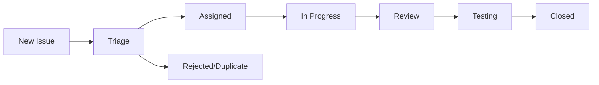

# GitHub Issues Execution Plan
## Comprehensive Strategy for Managing Issues Across Various Projects

### Table of Contents
1. [Overview](#overview)
2. [Issue Planning and Strategy](#issue-planning-and-strategy)
3. [Issue Templates and Classification](#issue-templates-and-classification)
4. [Workflow Management](#workflow-management)
5. [Prioritization and Triage](#prioritization-and-triage)
6. [Collaboration and Communication](#collaboration-and-communication)
7. [Cross-Project Coordination](#cross-project-coordination)
8. [Quality Assurance](#quality-assurance)
9. [Tracking and Reporting](#tracking-and-reporting)
10. [Automation and Tools](#automation-and-tools)
11. [Documentation and Knowledge Management](#documentation-and-knowledge-management)
12. [Implementation Timeline](#implementation-timeline)

---

## Overview

This document outlines a comprehensive plan for executing GitHub issues across multiple projects within the Top-TieR-Global-HUB-AI ecosystem. The plan focuses on standardization, efficiency, and effective collaboration while maintaining quality and transparency.

### Goals
- **Standardize** issue management across all projects
- **Improve** collaboration and communication
- **Enhance** tracking and reporting capabilities
- **Streamline** workflows and reduce overhead
- **Ensure** quality and consistency in issue resolution

---

## Issue Planning and Strategy

### 1. Issue Lifecycle Management


### 2. Strategic Objectives
- **Feature Development**: New capabilities and enhancements
- **Bug Resolution**: Critical and non-critical bug fixes
- **Documentation**: Technical and user documentation updates
- **Performance**: Optimization and scalability improvements
- **Security**: Vulnerability fixes and security enhancements
- **Maintenance**: Code refactoring and technical debt reduction

### 3. Project Alignment
- Ensure issues align with project roadmaps
- Regular synchronization with product owners
- Integration with sprint planning cycles

---

## Issue Templates and Classification

### 1. Standard Issue Templates

#### Bug Report Template
```markdown
## Bug Description
A clear and concise description of the bug.

## Steps to Reproduce
1. Go to '...'
2. Click on '...'
3. Scroll down to '...'
4. See error

## Expected Behavior
Description of expected behavior.

## Actual Behavior
Description of what actually happens.

## Environment
- OS: [e.g., Ubuntu 20.04]
- Browser: [e.g., Chrome 91]
- Version: [e.g., v2.1.0]

## Additional Context
Screenshots, logs, or additional information.

## Impact Assessment
- [ ] Critical (System down)
- [ ] High (Major functionality affected)
- [ ] Medium (Minor functionality affected)
- [ ] Low (Cosmetic issue)
```

#### Feature Request Template
```markdown
## Feature Description
Clear description of the requested feature.

## Problem Statement
What problem does this feature solve?

## Proposed Solution
Detailed description of the proposed solution.

## Alternative Solutions
Alternative approaches considered.

## User Stories
- As a [user type], I want [goal] so that [benefit]

## Acceptance Criteria
- [ ] Criteria 1
- [ ] Criteria 2
- [ ] Criteria 3

## Technical Requirements
- Dependencies
- Implementation considerations
- Performance requirements

## Priority
- [ ] Critical
- [ ] High
- [ ] Medium
- [ ] Low
```

#### Documentation Request Template
```markdown
## Documentation Type
- [ ] API Documentation
- [ ] User Guide
- [ ] Developer Documentation
- [ ] Architecture Documentation
- [ ] Other: ___________

## Description
What documentation is needed?

## Target Audience
Who will use this documentation?

## Scope
What should be covered?

## Success Criteria
How do we know the documentation is complete?
```

### 2. Label Classification System

#### Type Labels
- `type:bug` - Bug reports
- `type:feature` - Feature requests
- `type:enhancement` - Improvements to existing features
- `type:documentation` - Documentation-related
- `type:maintenance` - Code maintenance and refactoring
- `type:security` - Security-related issues

#### Priority Labels
- `priority:critical` - Must be fixed immediately
- `priority:high` - Should be addressed in current sprint
- `priority:medium` - Can be scheduled for next sprint
- `priority:low` - Nice to have, no immediate timeline

#### Status Labels
- `status:triage` - Needs initial review
- `status:backlog` - Approved but not yet started
- `status:in-progress` - Currently being worked on
- `status:review` - Under code/design review
- `status:testing` - In testing phase
- `status:blocked` - Blocked by external dependencies

#### Domain Labels
- `domain:osint` - OSINT-related functionality
- `domain:api` - API-related issues
- `domain:ui` - User interface
- `domain:database` - Database-related
- `domain:security` - Security features
- `domain:performance` - Performance optimization

---

## Workflow Management

### 1. Issue Triage Process
1. **Initial Review** (within 24 hours)
   - Validate issue format and completeness
   - Apply appropriate labels
   - Assign to relevant team member if obvious
   - Request additional information if needed

2. **Technical Assessment** (within 48 hours)
   - Evaluate technical feasibility
   - Estimate effort required
   - Identify dependencies
   - Assign priority level

3. **Planning Integration** (weekly)
   - Include in sprint planning
   - Allocate to appropriate milestone
   - Update project boards

### 2. Assignment Strategy
- **Auto-assignment** for specific file changes
- **Round-robin** assignment for general issues
- **Expertise-based** assignment for complex issues
- **Volunteer** system for open-source contributions

### 3. Review Process
- **Peer Review**: All changes reviewed by at least one team member
- **Code Review**: Technical review for code changes
- **Documentation Review**: Content and technical accuracy review
- **Final Approval**: Project maintainer approval for critical changes

---

## Prioritization and Triage

### 1. Priority Matrix
| Impact | Urgency | Priority | Action |
|--------|---------|----------|---------|
| High | High | Critical | Immediate action |
| High | Low | High | Plan for current sprint |
| Low | High | Medium | Schedule appropriately |
| Low | Low | Low | Backlog |

### 2. Triage Criteria
- **Security vulnerabilities**: Highest priority
- **Production bugs**: High priority based on user impact
- **Feature requests**: Prioritized by business value
- **Documentation**: Scheduled based on user needs
- **Technical debt**: Balanced with feature development

### 3. Escalation Process
- Issues blocking production: Immediate escalation
- Unresolved issues > 30 days: Weekly review
- Community requests: Monthly review
- Feature requests: Quarterly planning review

---

## Collaboration and Communication

### 1. Communication Channels
- **GitHub Comments**: Primary discussion forum
- **Project Meetings**: Weekly sync for active issues
- **Slack/Discord**: Real-time coordination
- **Email**: Formal notifications and updates

### 2. Stakeholder Involvement
- **Product Owners**: Priority setting and feature validation
- **Developers**: Technical implementation and review
- **QA Team**: Testing and validation
- **Community**: Feedback and contributions
- **Users**: Requirements and acceptance testing

### 3. Status Updates
- **Daily**: Progress updates in comments
- **Weekly**: Status summary in project boards
- **Monthly**: Metrics and progress reports
- **Quarterly**: Roadmap alignment review

---

## Cross-Project Coordination

### 1. Multi-Repository Issues
- Use organization-level project boards
- Link related issues across repositories
- Maintain dependency tracking
- Coordinate release schedules

### 2. Shared Components
- Centralized issue tracking for shared libraries
- Version compatibility management
- Breaking change notifications
- Migration guides and documentation

### 3. Integration Points
- API compatibility issues
- Database schema changes
- Configuration management
- Deployment coordination

---

## Quality Assurance

### 1. Definition of Done
- [ ] Code implemented and reviewed
- [ ] Unit tests written and passing
- [ ] Integration tests updated
- [ ] Documentation updated
- [ ] Security review completed (if applicable)
- [ ] Performance impact assessed
- [ ] Accessibility requirements met
- [ ] Browser/platform compatibility verified

### 2. Testing Requirements
- **Unit Tests**: Minimum 80% code coverage
- **Integration Tests**: All API endpoints tested
- **E2E Tests**: Critical user journeys covered
- **Security Tests**: Vulnerability scanning
- **Performance Tests**: Load and stress testing

### 3. Review Checklist
- [ ] Code follows style guidelines
- [ ] Security best practices followed
- [ ] Performance considerations addressed
- [ ] Documentation is clear and complete
- [ ] Tests are comprehensive
- [ ] Backward compatibility maintained

---

## Tracking and Reporting

### 1. Key Metrics
- **Issue Velocity**: Issues closed per sprint
- **Response Time**: Time to first response
- **Resolution Time**: Time from creation to closure
- **Bug Escape Rate**: Bugs found in production
- **Customer Satisfaction**: User feedback scores

### 2. Reporting Schedule
- **Daily**: Team standup metrics
- **Weekly**: Sprint progress reports
- **Monthly**: Trend analysis and insights
- **Quarterly**: Strategic review and planning

### 3. Dashboards and Visualization
- GitHub Insights integration
- Custom metrics dashboards
- Burndown charts for sprints
- Cumulative flow diagrams
- Issue age distribution

---

## Automation and Tools

### 1. GitHub Actions Integration
```yaml
name: Issue Management
on:
  issues:
    types: [opened, labeled, assigned]
  
jobs:
  triage:
    runs-on: ubuntu-latest
    steps:
      - name: Auto-label
        uses: github/issue-labeler@v2
      - name: Assign based on files
        uses: kentaro-m/auto-assign-action@v1
      - name: Update project boards
        uses: alex-page/github-project-automation-plus@v0.8.1
```

### 2. Bot Integration
- **Welcome bot**: Greet new contributors
- **Stale issue management**: Close inactive issues
- **Duplicate detection**: Identify similar issues
- **Automatic labeling**: Based on content analysis

### 3. External Integrations
- **Slack notifications**: Real-time updates
- **Jira synchronization**: Enterprise planning
- **Monitoring tools**: Error tracking integration
- **Documentation**: Auto-update based on changes

---

## Documentation and Knowledge Management

### 1. Knowledge Base
- **FAQ**: Common issues and solutions
- **Troubleshooting guides**: Step-by-step problem resolution
- **Architecture decisions**: Technical rationale documentation
- **Best practices**: Development and contribution guidelines

### 2. Issue History
- Maintain searchable issue archives
- Document resolution patterns
- Track recurring issues
- Build institutional knowledge

### 3. Learning Resources
- **Onboarding guides**: New contributor resources
- **Video tutorials**: Complex setup procedures
- **Code examples**: Implementation patterns
- **Community resources**: External documentation links

---

## Implementation Timeline

### Phase 1: Foundation (Weeks 1-2)
- [ ] Set up issue templates
- [ ] Configure label system
- [ ] Create project boards
- [ ] Establish triage process
- [ ] Train team members

### Phase 2: Automation (Weeks 3-4)
- [ ] Implement GitHub Actions workflows
- [ ] Configure bot integrations
- [ ] Set up monitoring dashboards
- [ ] Create reporting templates
- [ ] Test automation workflows

### Phase 3: Optimization (Weeks 5-6)
- [ ] Analyze initial metrics
- [ ] Refine processes based on feedback
- [ ] Optimize automation rules
- [ ] Enhance documentation
- [ ] Conduct team retrospective

### Phase 4: Scale and Iterate (Ongoing)
- [ ] Monitor effectiveness metrics
- [ ] Gather stakeholder feedback
- [ ] Iterate on processes
- [ ] Scale to additional projects
- [ ] Continuous improvement

---

## Success Metrics

### Quantitative Metrics
- **Issue Resolution Time**: Target 80% of issues resolved within SLA
- **First Response Time**: < 24 hours for critical, < 48 hours for others
- **Issue Backlog Size**: Maintain manageable backlog size
- **Team Velocity**: Consistent or improving sprint velocity
- **Quality Metrics**: Reduced production bugs, improved test coverage

### Qualitative Metrics
- **Team Satisfaction**: Regular survey feedback
- **Community Engagement**: Active participation and contributions
- **Process Efficiency**: Reduced overhead and improved focus
- **Knowledge Sharing**: Improved documentation and collaboration
- **Stakeholder Satisfaction**: Positive feedback from product owners

---

## Conclusion

This comprehensive GitHub issues execution plan provides a structured approach to managing issues across various projects within the Top-TieR-Global-HUB-AI ecosystem. Success depends on consistent implementation, regular monitoring, and continuous improvement based on feedback and metrics.

The plan emphasizes:
- **Standardization** across all projects
- **Transparency** in processes and progress
- **Collaboration** among all stakeholders
- **Quality** in both process and outcomes
- **Continuous improvement** based on data and feedback

Regular review and adaptation of this plan will ensure it continues to meet the evolving needs of the project and community.